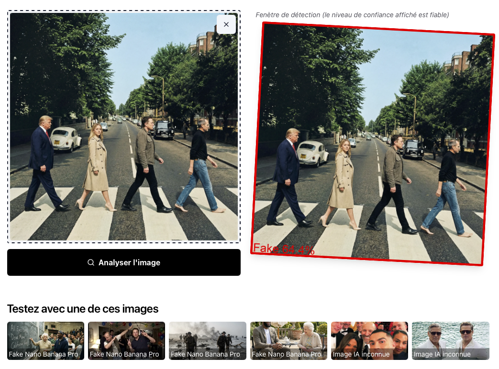

# Fakefinder images IA vs Real NanoBananaPro et autres

Application web permettant de détecter si une image a été générée par une Intelligence Artificielle (Midjourney, DALL-E, Stable Diffusion et NanoBananaPro) ou si elle est réelle.


*   **Précision globale :** 90% (score F1 90%, testé sur 2000 images de validation)
*   **Précision selfies smartphone :** 80%



## 📁 Dataset d'entraînement
12000 images (6000 réelles / 3000 Midjourney,SD,Dall-e / 3000 Nano Banana Pro)
```bash
https://huggingface.co/datasets/julienlucas/midjourney-dalle-sd-nanobananapro-dataset
```

## 🏗 Architecture

Le projet est divisé en deux parties :

*   **Frontend** : Interface utilisateur en **React** (Vite + TailwindCSS).
*   **Backend** : API en **Django** utilisant **ONNX Runtime** pour l'inférence rapide et légère (sans PyTorch en production).

## 🚀 Installation et Lancement

### Backend

Le backend gère l'analyse des images via le modèle ONNX optimisé.

```bash
# Aller dans le dossier backend (racine du projet pour Django)
cd backend

# Installer les dépendances
uv sync

# Lancer le serveur de développement
uv run manage.py runserver
```

L'API sera accessible sur `http://localhost:8000`.

### Frontend

L'interface permet d'uploader une image et de visualiser le résultat avec une heatmap (Grad-CAM).

```bash
# Aller dans le dossier frontend
cd frontend

# Installer les dépendances
pnpm install  # ou npm install

# Lancer le serveur de développement
pnpm dev      # ou npm run dev
```

L'application sera accessible sur `http://localhost:5173`.

---

## 🧠 Entraînement et Modèles (`/training`)

Le cœur de la détection repose sur un modèle de Deep Learning entraîné spécifiquement pour repérer les artefacts de génération d'images.

### Architecture du Modèle
Nous utilisons **EfficientNetV2-S** avec une architecture personnalisée "Double Pooling" :
*   **Backbone** : EfficientNetV2-S pré-entraîné.
*   **Double Pooling** : Combinaison de `AdaptiveAvgPool2d` (pour les patterns globaux) et `AdaptiveMaxPool2d` (pour détecter les artefacts locaux spécifiques aux IA).
*   **Head** : Couches linéaires optimisées pour la classification binaire (Fake vs Real).

### Pipeline d'Entraînement

Les scripts dans le répertoire `training/` permettent de reproduire le modèle :

1.  **Entraînement (`train_efficient_v2_s.py`)** :
    *   Utilise **PyTorch Lightning**.
    *   **Augmentations agressives** : Compression JPEG, Flou Gaussien, Bruit, etc., pour forcer le modèle à apprendre des caractéristiques robustes et éviter la mémorisation.
    *   **Focal Loss** : Pour se concentrer sur les exemples difficiles.

2.  **Optimisation des Hyperparamètres (`optimize_hyperparameters_hf.py`)** :
    *   Utilise **Optuna** avec le sampler **TPE (Tree-structured Parzen Estimator)** pour rechercher automatiquement les meilleurs hyperparamètres.
    *   **Hyperparamètres optimisés** :
        *   Learning rate (1e-5 à 5e-4, log scale)
        *   Weight decay (1e-5 à 1e-2, log scale)
        *   LR ratio backbone/head (0.01 à 0.2)
        *   Dropout (0.3 à 0.5)
        *   Label smoothing (0.0 à 0.05)
        *   Nombre de blocs à dégeler (1-4)
        *   Époque de dégel (2-4)
        *   Type de scheduler (OneCycleLR ou CosineWarmup)
    *   **Pruning adaptatif** : HyperbandPruner pour arrêter les essais non prometteurs tôt.
    *   **SWA (Stochastic Weight Averaging)** : Active à partir de 70% de l'entraînement pour stabiliser les derniers pourcents.
    *   **Upload automatique** : Les meilleurs modèles sont automatiquement sauvegardés sur Hugging Face Hub.
    *   **20 trials** de 15 epochs chacun pour trouver la configuration optimale.

2.  **Optimisation & Pruning (`optimize_prune_quantize.py`)** :
    *   **Pruning** : Suppression de 20% des poids les moins importants (L1 Unstructured) pour alléger le modèle.
    *   **Quantization** : Conversion et optimisation pour réduire la taille et accélérer l'inférence.

4.  **Ou export ONNX avec CAM (quantizé/prunné aussi) (`optimize_prune_quantize_with_cam.py`)**:
    *   Exporte le modèle au format **ONNX FP16**.
    *   Intègre les sorties nécessaires pour le **Class Activation Mapping (CAM)**, permettant de générer les heatmaps de visualisation directement depuis ONNX, sans avoir besoin de PyTorch complet en production.
    *   Benchmark automatique de la latence et de la précision après export.

### Modèles
Les modèles entraînés et optimisés sont stockés dans le dossier `/models` (ou `training/models` avant export final). Le backend utilise la version `.onnx` pour une performance maximale.

Ajoutez une étoile ⭐ si vous appréciez mon travail. 🙏